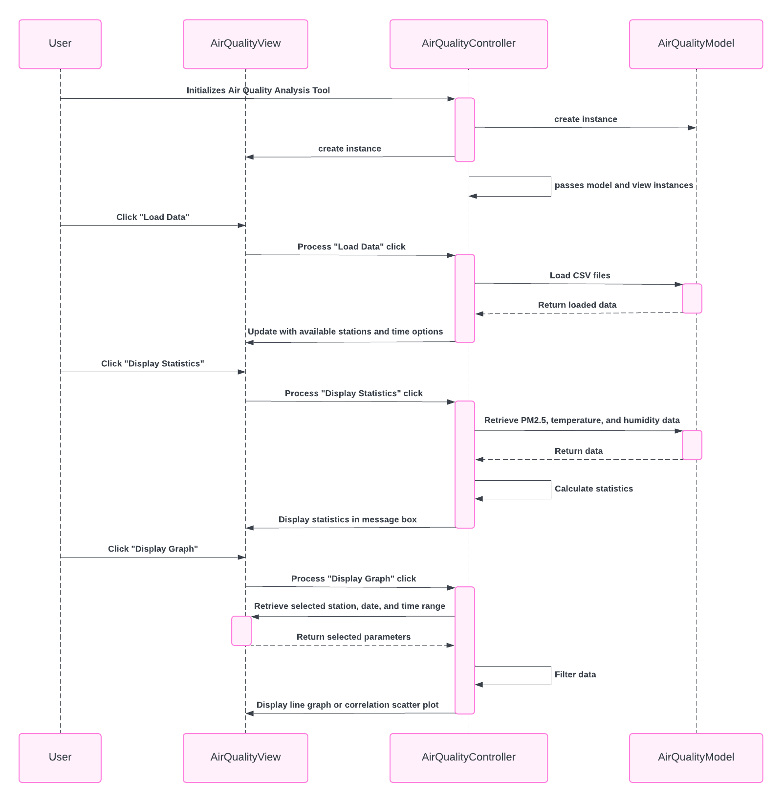

# Air Quality Analysis Tool

## Overview

## Required Data Files
- `pm25_data.csv`
- `temperature_data.csv`
- `humidity_data.csv`

For installation instructions, please refer to [Installation](https://github.com/SunthornK/Year1_Project/wiki/Installation).
The Air Quality Analysis Tool is a Python application designed to analyze and visualize air quality data. It provides functionalities for loading data, displaying statistics, and generating visualizations such as graphs and charts.

## Features

- **Data Loading**: Load air quality data from CSV files (`pm25_data.csv`, `temperature_data.csv`, `humidity_data.csv`).
  
- **Statistics**: Display statistics for PM2.5, temperature, and humidity data including mean, median, minimum, and maximum values.
  
- **Visualizations**:
  - Pie chart: Display distribution of PM2.5 categories.
  - Histogram: Visualize distribution of PM2.5 concentration.
  - Line graph: Show variation of PM2.5, temperature, and humidity over time.
  - Scatter plot: Display correlation between PM2.5 and other variables like temperature and humidity.

- **Nearest Station**: Find the nearest station based on latitude and longitude coordinates.

## UML Class Diagram

## UML Sequence Diagram

## UI Screenshots

## Video Demonstration

Watch the video demonstration [here](https://drive.google.com/file/d/1EA0h02twi82FzKtXD9TowNL4A8oDkVa5/view?usp=sharing).